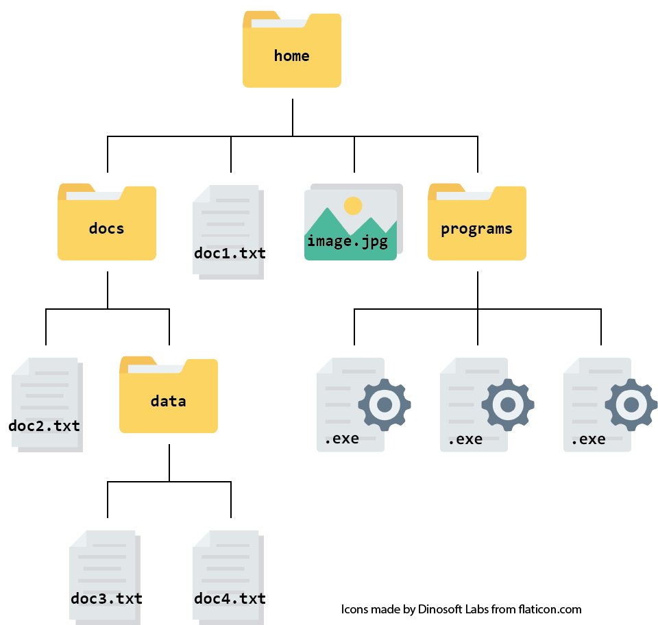
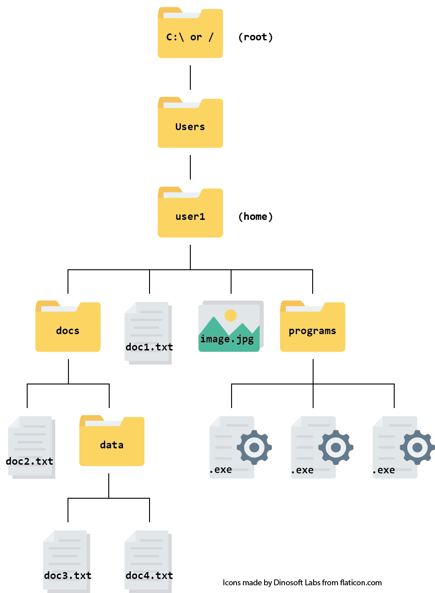

## What is a file system?

A file system is exactly what it sounds like - a way for your computer to store your data in an organised way using **files**.

You will definitely have come across **files** before. All the data stored on your computer is split into separate files, making it much easier to keep track of than if it was all in one big blob. 

There are lots of different file types; we can often find out something about what kind of data a file contains by looking at its **filename extension**. For example:
- **.txt** tells us that the file contains text
- **.exe** tells us that the file contains a program to be run
- **.html** tells us that the file contains a webpage, and should be run inside a web browser

We will come across various different file types during this course, some of which you may not have seen before. Do not worry. We will introduce them to you and explain how to use them when necessary.

In a file system, files are organised into **directories**, which can also be called **folders**. Hopefully you will have used folders to organise your files before! Folders can contain sub-folders, which contain their own sub-folders, and so on almost without limit. 

It is easiest to picture your file system as a tree, starting with the **root** (or **home**) directory and branching out from there. This is called a **hierarchical structure**. Here is an example of a hierarchical file structure:

{:width="450px"}

The directory you are working inside is called your **working directory**. For example, if you were editing `doc2.txt` in the diagram above, your working directory would be the folder called `docs`.

> ## Exercise
> Think about your own computer and how your files and directories are organised. Sketch a tree diagram like the one above for your file system.
>
> Hint: remind yourself of your file system's layout using a file manager application such as:
>
>| OS  |Icon |
>|:---|:---|
>| File Explorer (Windows) |  |
>| Finder (Mac) |  |
>
> You probably already use these applications regularly to find, open and organise files.
{: .challenge}

## File paths

It is not practical to draw out a tree diagram every time we want to refer to a file's location with a system. Instead, we can represent the information as a **file path**.

In a **file path**, each directory is represented as a separate component separated by a character such as `\` or `/`. It is like writing an address or set of instructions for someone to follow if they want to find a specific file.

For example, the path for the file called `doc3.txt` in the file system above looks like this:
`home/docs/data/doc3.txt`.

It is useful to note that Windows usually uses backslashes (`\`) to separate path components, while Unix and Mac both use forward slashes (`/`).

## Absolute vs relative paths

There are two ways of writing a file path - absolute paths and relative paths.

An absolute path contains the complete list of directories needed to locate a file on your computer. This allows you to reach the file no matter where you are. The example just given (`home/docs/data/doc3.txt`) is an absolute path.

A relative path describes the location of a file relative to your current working directory. For example, if you were already in the folder called `docs`, the relative path for `doc3.txt` would be `data/doc3.txt`. There is no need to give instructions to navigate a route you have already taken.

If, however, you were in the folder called `docs` and you wanted to open one of the `.exe` files, you would probably use the absolute path for that file (`home/programs/.exe`) to get there. This is because you have not navigated any of the route yet, so you need the full 'address'.

## Root and home directories

The `root` is the top-level of directories, which contains all other directories further down the tree.

The root is often represented as a `/` in path names. 

In the Windows operating system, the root directory is also known as a drive. In most cases, this will be the `C:\` drive.

Even though the root directory is at the base of the file tree (or the top, depending on how you view it), it is not necessarily where our journey through the file system starts when we launch a new session on your computer. Instead our journey begins in the **home directory**.

In Windows and Mac, the **home directory** is usually a folder labelled with your computer's username. All of your personal files and directories can be found inside this folder. This is where your computer assumes you want to start browsing from when you open your file manager.

This would make the file system we looked at earlier look like this:
{:width="450px"}

In Unix (the operating system our instance is running on) a tilde symbol (`~`) is used as a shortcut for your home directory. So, for example, the path `~/docs/doc2.txt` is equivalent to `home/docs/doc2.txt`.

> ##  Challenge
> Use the file system above to answer these questions. Don't forget to share your answer on the forum!
>
> 1. What is the absolute path for the document `doc4.txt`?
> 2. Assuming you are currently in the directory called `docs`, what is the relative path for the document `doc2.txt`?
>
> > ## Solution
> > 
> > 1. The absolute path is `home/docs/data/doc4.txt` or `~/docs/data/doc4.txt`.
> > 2. The relative path is `doc2.txt` (as you are already in the directory where `doc2.txt` is stored).
> >
> {: .solution}
{: .challenge}

## Create a folder for the course

To keep things tidy and easily accessible, we will create a folder (directory) to keep everything related to this course: the key you will need to log in, your notes, data etc. 

In theory you can make this file anywhere in your file system but we recommend making it inside your Desktop folder, to make it easy to access.

1. **Create the folder** `cloudspan` in your *Desktop*.

   Minimise all windows until you can see your desktop background. Right click and select *New*, then *Folder*. Name the folder `cloudspan`.

   You should see a folder icon appear on your desktop with the label `cloudspan`.

   Additionally, if you enter your file explorer application you should be able to click on the *Desktop* directory at the side and see the `cloudspan` folder.

2. **Write down the absolute path** to your `cloudspan` folder.

   Find out what the absolute path is using your file manager application. Right click on the folder, or in any blank space inside the folder, and then:
   - Windows users: select *Properties*, then look at the field called *Location*. Your path will be separated with backslashes (`\`) but you should write it down using forward slashes (`/`).
   - Mac Users: select *Get info*, then look at the field called *Where*. Your path should start with the word `Users/` - ignore anything that comes before this. Separate your path components using forward slashes (`/`).

   Now add the folder name (`/cloudspan`) to the end of this path. This is your absolute path.
   Once you have this written down, do not lose it! Now you can find your way back to the `cloudspan` folder whenever you need to, no matter where you are in your file structure.

## Download your login key file

Next we will download your unique login key file from the email you received from the Cloud-SPAN team. This type of file is called a `.pem` file. It contains a certificate which allows you to communicate with the Cloud securely. Without the `.pem` file you cannot access the Cloud.

For now we will use the file explorer to move the `.pem` file around.

1. **Find out where downloads are saved** on your computer.

   How you so this will depend on which browser you use. You can find instructions for changing your default download location in [Chrome](https://support.google.com/chrome/answer/95759?hl=en-GB&co=GENIE.Platform%3DDesktop), [Edge](https://support.microsoft.com/en-us/microsoft-edge/find-where-your-browser-is-saving-downloads-d3e83af6-68bb-aa90-3167-eeb657013902) or [Safari](https://support.apple.com/en-gb/guide/safari/sfri40598/mac).

   If you already know which folder your downloads go to, then you can skip this step.

2. **Download your login key file** to the folder you created a few minutes ago.

   Click on the link embedded in the email you received from the Cloud-SPAN team.
   
   **Mac users** may need to Click on 'download' when the file says it can't be opened.

   If your browser asks you "where do you want to download the file?", choose the `cloudspan` directory.

   Otherwise, once downloading is finished, copy and paste/drag and drop your login key file from wherever it was downloaded to your `cloudspan` folder.

## More about the file types we will be using

We will encounter three different file types over the course of Prenomics.

| File Type | Use |
|:---|:---|
| .pem | PEM files (like the one you just downloaded into your `cloudspan` directory) store a cryptographic key to allow you access a web domain such as the Cloud instance we will use in the next episode. You do not need to know anything about PEM files except that you will need one to be allowed access. |
| .txt | TXT files are a common way of storing lines of text. They can be opened in almost all text-editing or word-processing programs. They contain little formatting. |
| .fastq | FASTQ files are a text-based way of storing data from a sequencing experiment. They contain both the sequence and information about how accurate the sequence is. Your instructor will talk you through the example below. |

### FASTQ files
{:width="600px"}

In the FASTQ file format, each 'read' (i.e. sequence) is described in four lines of information.

- The first line is the sample name (also called the label) and may contain other information such as the read length.
- The second line is the sequence of bases itself
- The third line is a separator line which always starts with a '+' and may repeat the information from line 1
- The fourth line is a string of characters representing the quality scores for each base

You do not need to understand much detail about this format for the Prenomics course. You will learn more about it on day three of the [Cloud-SPAN Genomics course](https://cloud-span.github.io/genomics04-data-preparation-organisation/04-quality-control/index.html).