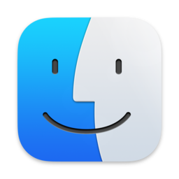

## What is a file system?

A file system is exactly what it sounds like - a way for your computer to store your data in an organised way using **files**.

You will definitely have come across **files** before. All the data stored on your computer is split into separate files, making it much easier to keep track of than if it was all in one big blob. 

There are lots of different file types; we can often find out something about what kind of data a file contains by looking at its **filename extension**. For example:
- **.txt** tells us that the file contains text
- **.exe** tells us that the file contains a program to be run
- **.html** tells us that the file contains a webpage, and should be run inside a web browser

We will come across various different file types during this course, some of which you may not have seen before. Do not worry. We will introduce them to you and explain how to use them when necessary.

In a file system, files are often organised into **directories**, which can also be called **folders**. Hopefully you will have used folders to organise your files before! Folders can contain sub-folders, which contain their own sub-folders, and so on almost without limit. 

It is easiest to picture your file system as a tree, starting with the **root** (or **home**) directory and branching out from there. This is called a **hierarchical structure**. Here is an example of a hierarchical file structure:

{:height="500px"}

The directory you are working inside is called your **working directory**. For example, if you were editing `doc2.txt` in the diagram above, your working directory would be the folder called `docs`.

> ## Exercise
> Think about your own computer and how your files and directories are organised. Sketch a tree diagram like the one above for your file system.
>
> Hint: remind yourself of your file system's layout using a file manager application such as:
>| File Explorer (Windows) | Finder (Mac) |
>|---|---|
>|||
>
>| File Explorer (Windows) |  |
>|---|---|
>|Finder (Mac) ||
>
> You probably use these applications regularly to find and organise files.
{: .challenge}

## File paths

It is not practical to draw out a tree diagram every time we want to refer to a file's location with a system. Instead, we can represent the information as a **file path**.

In a **file path**, each directory is represented as a separate component separated by a character such as `\` or `/`. It is like writing an address or set of instructions for someone to follow if they want to find a specific file.

For example, the path for the file called `doc3.txt` in the file system above looks like this:
`root/docs/data/doc3.txt`.

## Absolute vs relative paths

There are two ways of writing a file path - absolute paths and relative paths.

An absolute path contains the complete list of directories needed to locate a file on your computer. This allows you to reach the file no matter where you are. The example just given (`root/docs/data/doc3.txt`) is an absolute path.

A relative path describes the location of a file relative to your current working directory. For example, if you were already in the folder called `docs`, the relative path for `doc3.txt` would be `data/doc3.txt`. There is no need to give instructions to navigate a route you have already taken.

If, however, you were in the folder called `docs` and you wanted to open one of the `.exe` files, you would probably use the absolute path for that file (`root/programs/.exe`) to get there. This is because you have not navigated any of the route yet, so you need the full 'address'.

## Create a folder for the course

To keep things tidy and easily accessible, we will create a folder (directory) to keep everything related to this course: the key you will need to log in, your notes, data etc. 

In theory you can make this file anywhere in your file system but we recommend making it inside your Desktop folder, to make it easy to access.

1. **Create the folder** *cloudspan* in your *Desktop*.

   Minimise all windows until you can see your desktop background. Right click and select *New*, then *Folder*. Name the folder *cloudspan*.

   You should see a folder icon appear on your desktop with the label *cloudspan*.

   Additionally, if you enter your file explorer application you should be able to click on the *Desktop* directory at the side and see the *cloudspan* folder.

2. **Write down the absolute path** to your *cloudspan* folder.

   Find out what the absolute path is using your file manager application. Right click on the folder, or in any blank space inside the folder, and select *Properties*.

   The field called *Location* will tell you the absolute path for your folder. Once you have this written down, do not lose it! Now you can find your way back to the *cloudspan* folder whenever you need to, no matter where you are in your file structure.

****

We will then download your login key file to that folder and change its access permissions for the reasons given below. Finally we will login into your instance with ssh.

2. **Download your login key file** to the folder you just created.

   Click on the link embedded in the email you received from the Cloud-SPAN team.
   
   **Mac users** may need to Click on 'download' when the file says it can't be opened.

   If your browser asks you "where do you want to download the file?", choose the directory for the course you just created.

   Otherwise, drag and drop your login key file from wherever it was downloaded to the folder for the course you created.
