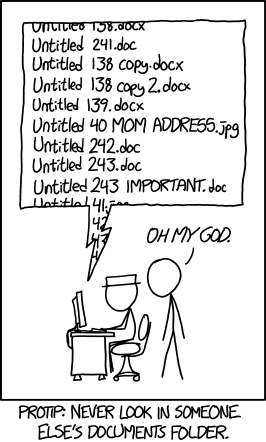

Welcome to the first lesson in Cloud-SPAN’s **Prenomics** course!

This course is designed to help you get the foundational skills and knowledge needed for our[ Cloud Genomics](https://cloud-span.github.io/genomics01-intro/) course, where you will learn how to analyse ‘omics data using cloud-based High Performance Computing (HPC) resources.

In this lesson we will learn how the files and directories on your computer are structured, as well as logging onto the cloud and using the command line (also known as the shell) for the very first time. 

> ## Getting Started
>
> This lesson assumes **no prior experience** with the tools covered in the course. It is designed for absolute beginners.
>
> Not everyone will need to complete this module - try [our quiz](https://shiny.york.ac.uk/er13/prenomics-quiz/#section-some-general-questions) to help you judge whether you would benefit from attending.
>
> This lesson is part of a course that uses data hosted on an Amazon Machine Instance (AMI). Workshop participants will be given information on how to log-in to the AMI during the course.
> Information on preparing for the course is provided on the [Cloud-SPAN Genomics Course setup page](https://cloud-span.github.io/genomics01-intro/setup.html).
{: .prereq}
